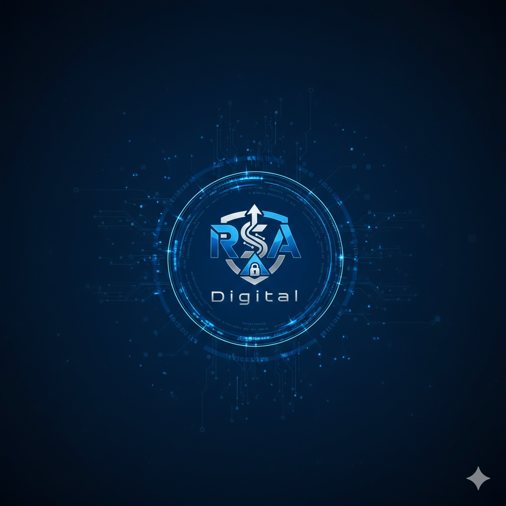

# RSA Digital - Business Management App

<div align="center">



**Your Complete Business Companion**

[](https://www.android.com/)
[](https://github.com/)
[](https://github.com/)

</div>

---

## 📱 About RSA Digital

**RSA Digital** is a powerful, all-in-one business management mobile application designed for small business owners, shopkeepers, and entrepreneurs. The app helps you manage your daily operations efficiently with features like note-taking, customer ledger (Khata), and expense tracking.

---

## 🛒 Google Play Store Information

### Short Description (80 characters max)
```
Manage your business easily - Notes, Khata (Ledger) & Expense Tracking in one app!
```

### Full Description (4000 characters max)
```
📱 RSA Digital - Your Complete Business Management Solution

Are you a small business owner, shopkeeper, or entrepreneur looking for an easy way to manage your daily operations? RSA Digital is the perfect app for you!

🎯 WHO IS THIS APP FOR?
• Small business owners
• Shop keepers & retailers
• Freelancers & entrepreneurs
• Anyone who wants to track expenses and manage customer accounts

✨ KEY FEATURES:

🏠 SMART DASHBOARD
• Quick access to all features with one tap
• View total notes, customers, and expenses at a glance
• Track your recent activities across all modules
• Complete activity history with filtering options

📝 NOTES MANAGEMENT
• Create and manage unlimited notes
• Quick search functionality
• Date-wise organization
• Clean and easy-to-read interface

👥 KHATA (CUSTOMER LEDGER)
• Add and manage customer profiles
• Track customer balances (To Receive / To Pay)
• Store phone numbers for quick contact
• Search customers by name or phone
• Summary cards showing total receivables and payables

💰 EXPENSE TRACKING
• Record daily expenses with categories
• View total expense summary
• Category-wise organization (Food, Transport, Shopping, Bills, etc.)
• Search and filter expenses
• Get insights and analytics on your spending

📊 ALL ACTIVITIES VIEW
• Combined view of all your data
• Filter by category (Notes, Customers, Expenses)
• Customer balance overview
• Date-wise sorting

🔒 PRIVACY & SECURITY
• 100% Offline - Works without internet
• All data stored locally on your device
• No account required - Start using immediately
• No data collection - Your data stays with you
• No ads - Clean, distraction-free experience

🎨 BEAUTIFUL DESIGN
• Dark navy blue theme - Easy on eyes
• Modern card-based UI
• Smooth animations
• Intuitive navigation

Download RSA Digital today and take control of your business!

📧 Support: support@rsadigital.com
```

---

## 📋 Play Store Listing Details

### App Information

| Field | Value |
|-------|-------|
| **App Name** | RSA Digital |
| **Developer Name** | RSA Digital |
| **Package Name** | com.rsadigital.app |
| **Category** | Business |
| **Content Rating** | Everyone (E) |
| **Target Age Group** | 18+ (Business Users) |
| **Contains Ads** | No |
| **In-App Purchases** | No |

### App Specifications

| Property | Details |
|----------|---------|
| **Version** | 1.0.0 |
| **Min Android Version** | Android 6.0 (API 23) |
| **Target Android** | Android 14 (API 34) |
| **App Size** | ~49 MB |
| **Language** | English |
| **Data Storage** | Local (On Device) |

---

## 🔐 Data Safety (Play Store Required)

### Data Collection & Sharing

| Question | Answer |
|----------|--------|
| Does this app collect user data? | **No** |
| Does this app share user data with third parties? | **No** |
| Is data encrypted in transit? | **Not Applicable** (Offline App) |
| Can users request data deletion? | **Yes** (Uninstall app to delete all data) |

### Data Types

| Data Type | Collected | Shared | Purpose |
|-----------|-----------|--------|---------|
| Personal Info | ❌ No | ❌ No | - |
| Financial Info | ❌ No | ❌ No | - |
| Location | ❌ No | ❌ No | - |
| Contacts | ❌ No | ❌ No | - |
| Photos/Videos | ❌ No | ❌ No | - |
| Files & Docs | ❌ No | ❌ No | - |
| App Activity | ❌ No | ❌ No | - |
| Device Info | ❌ No | ❌ No | - |

### Security Practices
- ✅ Data is stored locally on device only
- ✅ No network permissions required
- ✅ No third-party SDKs or analytics
- ✅ Users can delete data by uninstalling the app
- ✅ No account or sign-up required

---

## 📜 Privacy Policy

**Last Updated: February 2026**

### Introduction
RSA Digital ("we", "our", or "us") is committed to protecting your privacy. This Privacy Policy explains how our mobile application handles your information.

### Information We Collect
**We do NOT collect any personal information.** RSA Digital is a completely offline application that stores all data locally on your device.

### Data Storage
- All notes, customer information, and expense data are stored locally on your device using AsyncStorage
- No data is transmitted to any server or third party
- No cloud storage or backup is performed by the app

### Data Sharing
- We do NOT share any data with third parties
- We do NOT use any analytics or tracking services
- We do NOT display advertisements

### Permissions
RSA Digital does NOT require any special permissions:
- ❌ No Camera access
- ❌ No Microphone access
- ❌ No Location access
- ❌ No Contacts access
- ❌ No Storage access (uses app-specific storage only)
- ❌ No Internet access

### Data Retention
All data remains on your device until:
- You manually delete it within the app
- You uninstall the application
- You clear the app data from device settings

### User Rights
You have complete control over your data:
- **Access**: All your data is visible within the app
- **Delete**: You can delete any record within the app
- **Export**: Currently not available (planned for future updates)
- **Portability**: Data is stored locally and can be removed by uninstalling

### Children's Privacy
This app is designed for business users (18+). We do not knowingly collect information from children under 13 years of age.

### Changes to Privacy Policy
We may update this Privacy Policy from time to time. Any changes will be reflected in the "Last Updated" date.

### Contact Us
If you have questions about this Privacy Policy, contact us at:
- **Email**: support@rsadigital.com

---

## ✨ Key Features

### 🏠 Home Dashboard
- **Quick Actions** - Access all features with one tap
- **Overview Stats** - View total notes, customers, and expenses at a glance
- **Recent Activities** - Track your latest actions across all modules
- **View All** - See complete activity history with filtering options

### 📝 Notes Management
- Create and manage unlimited notes
- Quick search functionality
- Date-wise organization
- Clean and easy-to-read interface

### 👥 Khata (Customer Ledger)
- Add and manage customer profiles
- Track customer balances (To Receive / To Pay)
- Phone number storage for quick contact
- Search customers by name or phone
- Summary cards showing total receivables and payables

### 💰 Expense Tracking
- Record daily expenses with categories
- View total expense summary
- Category-wise organization (Food, Transport, Shopping, Bills, etc.)
- Search and filter expenses
- Expense insights and analytics

### 📊 All Activities Screen
- Combined view of all data (Notes, Customers, Expenses)
- Filter by category (All, Notes, Customers, Expenses)
- Summary cards with totals
- Customer balance overview
- Date-wise sorting

---

## 🎨 Design & UI

- **Dark Navy Blue Theme** - Easy on eyes, professional look
- **Modern Card-Based UI** - Clean and organized layout
- **Smooth Animations** - Delightful user experience
- **Intuitive Navigation** - Easy to use for all age groups
- **Accessibility Support** - Designed for everyone

---

## 📲 Screens Overview

| Screen | Description |
|--------|-------------|
| **Home** | Dashboard with quick actions and overview |
| **Notes** | Create and manage notes |
| **Khata** | Customer ledger management |
| **Expenses** | Daily expense tracking |
| **All Activities** | Combined view of all data |

---

## 🖼️ Play Store Graphics Requirements

### Required Assets

| Asset | Dimensions | Format |
|-------|------------|--------|
| **App Icon** | 512 x 512 px | PNG (32-bit, alpha) |
| **Feature Graphic** | 1024 x 500 px | PNG or JPG |
| **Screenshots** | Min 2 required | PNG or JPG |

### Screenshot Specifications

| Device Type | Dimensions |
|-------------|------------|
| Phone | 1080 x 1920 px (9:16) or 1080 x 2400 px |
| 7" Tablet | 1200 x 1920 px |
| 10" Tablet | 1600 x 2560 px |

### Recommended Screenshots (8 max)
1. Home Dashboard - Overview
2. Notes Screen - List View
3. Add Note Modal
4. Khata Screen - Customer List
5. Add Customer Modal
6. Expenses Screen - Expense List
7. Add Expense Modal
8. All Activities Screen

---

## 🛠️ Technical Details

### Built With
- **React Native** - Cross-platform mobile framework
- **Expo** - Development platform
- **TypeScript** - Type-safe JavaScript
- **AsyncStorage** - Local data persistence
- **React Navigation** - Seamless navigation

### Architecture
- Component-based architecture
- Modular screen design
- Reusable UI components
- Clean code structure

---

## ❓ Frequently Asked Questions (FAQ)

### Q1: Is my data safe?
**A:** Yes! All your data is stored locally on your device. We don't collect, store, or share any of your information.

### Q2: Does the app need internet?
**A:** No, RSA Digital works completely offline. No internet connection is required.

### Q3: How do I backup my data?
**A:** Currently, the app stores data locally only. Cloud backup feature is planned for future updates.

### Q4: How do I delete my data?
**A:** You can delete individual records within the app, or uninstall the app to remove all data.

### Q5: Is this app free?
**A:** Yes, RSA Digital is completely free with no ads or in-app purchases.

### Q6: Which devices are supported?
**A:** RSA Digital supports Android devices running Android 6.0 (Marshmallow) or higher.

### Q7: Can I use this app for multiple businesses?
**A:** Currently, the app supports single business management. Multiple business profiles are planned for future updates.

---

## 📥 Installation

1. Download the APK/AAB file
2. Enable "Install from Unknown Sources" (for APK)
3. Install the app
4. Start managing your business!

---

## 🚀 Version History

### Version 1.0.0 (February 2026)
- 🎉 Initial Release
- ✅ Home Dashboard with Quick Actions
- ✅ Notes Management
- ✅ Khata (Customer Ledger)
- ✅ Expense Tracking
- ✅ All Activities View
- ✅ Search & Filter functionality
- ✅ Dark Theme UI

---

## 🔮 Future Updates (Roadmap)

- [ ] Data backup to cloud
- [ ] PDF report generation
- [ ] Transaction history for customers
- [ ] Multiple business profiles
- [ ] Dark/Light theme toggle
- [ ] SMS reminders for dues
- [ ] Export data to Excel
- [ ] Multi-language support (Urdu, Hindi)
- [ ] Biometric app lock
- [ ] Widget for quick access

---

## 📞 Contact & Support

### Developer Information
| Field | Details |
|-------|---------|
| **Developer Name** | RSA Digital |
| **Email** | support@rsadigital.com |
| **Phone** | +92-XXX-XXXXXXX |
| **Website** | www.rsadigital.com |
| **Address** | [Your Business Address] |

### Support Channels
- 📧 **Email**: support@rsadigital.com
- 📱 **Phone**: +92-XXX-XXXXXXX
- 🌐 **Website**: www.rsadigital.com

---

## 📜 Terms of Service

By downloading and using RSA Digital, you agree to these terms:

1. **Usage**: This app is intended for personal business management purposes only.
2. **Data Responsibility**: You are responsible for the accuracy of data you enter.
3. **No Warranty**: The app is provided "as is" without warranty of any kind.
4. **Liability**: We are not liable for any data loss or damages arising from app usage.
5. **Updates**: We may update the app and these terms at any time.
6. **Termination**: We reserve the right to discontinue the app at any time.

---

## 📄 License

Copyright © 2026 RSA Digital. All rights reserved.

This application is proprietary software. Unauthorized copying, modification, distribution, or use of this software is strictly prohibited.

---

## 🏷️ App Store Tags/Keywords

```
business management, khata, ledger, expense tracker, notes app, 
small business, shopkeeper app, accounting, finance manager, 
expense manager, customer management, Pakistani business app, 
offline app, free business app, udhar khata, hisab kitab
```

---

<div align="center">

**Made with ❤️ for Small Business Owners**

*RSA Digital - Simplifying Business Management*

**⭐ Rate us on Play Store if you love the app! ⭐**

</div>
